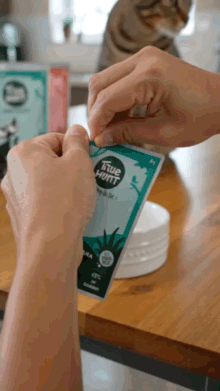
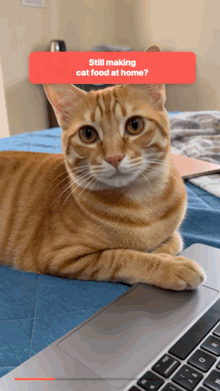

# AI UGC Factory

[中文 README](README.zh-CN.md) · [AIVideoPro.io](https://aivideopro.io) · [English website](https://1229119561weike.github.io/ai-ugc-factory/en/) · [中文网站](https://1229119561weike.github.io/ai-ugc-factory/zh/) · [Demo Release](https://github.com/1229119561Weike/ai-ugc-factory/releases/tag/v0.1.0)

**AI UGC Factory** is an open-source workflow for building enterprise-grade AI ad asset systems and producing AI UGC ad videos in batches.

It is designed for founders, growth teams, agencies, and creators who want a reusable production line instead of one-off prompts: product intake, asset mapping, reference control, UGC script design, generation prompt packs, QA gates, demo packaging, and performance-learning loops.

> Matrix launch note: the full Matrix product link is coming soon. For early access or collaboration, see [`assets/contact/wechat-qr.jpg`](assets/contact/wechat-qr.jpg).

## What this project gives you

- A reusable **AI UGC Factory skill** for turning product assets into production-ready ad video briefs.
- Asset manifest templates for real product images, webpages, references, videos, and contact assets.
- Prompt-pack examples for UGC videos, demo reels, and ad-asset systems.
- Separate English and Chinese GitHub Pages.
- Directly playable demo videos hosted as GitHub Release assets.

## Why it exists

Most AI ad workflows fail because they treat video generation as a prompt-writing problem. Production quality usually comes from a system:

1. real product assets are organized and named by function;
2. reference images/videos are attached as model-readable inputs, not merely described;
3. every 1-2 second beat has a job: hook, proof, benefit, objection, CTA;
4. voice, pacing, visuals, and claims are QA'd before delivery;
5. winning angles become reusable batches.

This repo packages that system into a compact open-source starter.

## Repository structure

```text
skills/ai-ugc-factory/        # reusable Matrix/agent skill
examples/briefs/              # product brief examples
examples/asset-manifests/     # asset inventory examples
examples/prompt-packs/        # prompt-pack examples
templates/                    # reusable production templates
docs/                         # GitHub Pages project website
assets/contact/               # early-access contact asset
scripts/                      # helper scripts
```

## Quick start

1. Copy `templates/product-brief.md` and fill in the product, audience, claims, and offer boundaries.
2. Put real assets in a stable folder and build an asset manifest from `templates/asset-manifest.csv`.
3. Use `skills/ai-ugc-factory/SKILL.md` as the production workflow.
4. Draft a prompt pack with `templates/video-prompt-pack.md`.
5. Run the QA checklist before rendering or publishing.

## Demo videos

GitHub README filters embedded MP4 players, so the previews below are animated GIFs that play directly on the repository page. Click any preview to open the full MP4.

- English page with full video players: https://1229119561weike.github.io/ai-ugc-factory/en/
- Chinese page with full video players: https://1229119561weike.github.io/ai-ugc-factory/zh/
- Release assets: https://github.com/1229119561Weike/ai-ugc-factory/releases/tag/v0.1.0
- AI video SaaS example: https://aivideopro.io

<table>
<tr>
<td width="33%" valign="top">
<a href="https://github.com/1229119561Weike/ai-ugc-factory/releases/download/v0.1.0/Feishu20260615-145618.mp4"></a><br />
<strong>Pet food short UGC</strong><br />
<a href="https://github.com/1229119561Weike/ai-ugc-factory/releases/download/v0.1.0/Feishu20260615-145618.mp4">Play full MP4</a>
</td>
<td width="33%" valign="top">
<a href="https://github.com/1229119561Weike/ai-ugc-factory/releases/download/v0.1.0/Feishu20260615-145621.mp4"></a><br />
<strong>Pet food long UGC</strong><br />
<a href="https://github.com/1229119561Weike/ai-ugc-factory/releases/download/v0.1.0/Feishu20260615-145621.mp4">Play full MP4</a>
</td>
<td width="33%" valign="top">
<a href="https://github.com/1229119561Weike/ai-ugc-factory/releases/download/v0.1.0/Feishu20260615-145625.mp4"></a><br />
<strong>Pet food product demo A</strong><br />
<a href="https://github.com/1229119561Weike/ai-ugc-factory/releases/download/v0.1.0/Feishu20260615-145625.mp4">Play full MP4</a>
</td>
</tr>
<tr>
<td width="33%" valign="top">
<a href="https://github.com/1229119561Weike/ai-ugc-factory/releases/download/v0.1.0/Feishu20260615-145628.mp4"></a><br />
<strong>Pet food product demo B</strong><br />
<a href="https://github.com/1229119561Weike/ai-ugc-factory/releases/download/v0.1.0/Feishu20260615-145628.mp4">Play full MP4</a>
</td>
<td width="33%" valign="top">
<a href="https://github.com/1229119561Weike/ai-ugc-factory/releases/download/v0.1.0/PieceStory_DemoA_realperson_30s_9x16.mp4"></a><br />
<strong>PieceStory real-person demo</strong><br />
<a href="https://github.com/1229119561Weike/ai-ugc-factory/releases/download/v0.1.0/PieceStory_DemoA_realperson_30s_9x16.mp4">Play full MP4</a>
</td>
<td width="33%" valign="top">
<a href="https://github.com/1229119561Weike/ai-ugc-factory/releases/download/v0.1.0/PieceStory_DemoB_anime_25s_9x16.mp4"></a><br />
<strong>PieceStory anime demo</strong><br />
<a href="https://github.com/1229119561Weike/ai-ugc-factory/releases/download/v0.1.0/PieceStory_DemoB_anime_25s_9x16.mp4">Play full MP4</a>
</td>
</tr>
<tr>
<td width="33%" valign="top">
<a href="https://github.com/1229119561Weike/ai-ugc-factory/releases/download/v0.1.0/Feishu20260615-145558.mp4"></a><br />
<strong>Course education demo A</strong><br />
<a href="https://github.com/1229119561Weike/ai-ugc-factory/releases/download/v0.1.0/Feishu20260615-145558.mp4">Play full MP4</a>
</td>
<td width="33%" valign="top">
<a href="https://github.com/1229119561Weike/ai-ugc-factory/releases/download/v0.1.0/Feishu20260615-145604.mp4"></a><br />
<strong>Course education demo B</strong><br />
<a href="https://github.com/1229119561Weike/ai-ugc-factory/releases/download/v0.1.0/Feishu20260615-145604.mp4">Play full MP4</a>
</td>
<td width="33%" valign="top">
<a href="https://github.com/1229119561Weike/ai-ugc-factory/releases/download/v0.1.0/Feishu20260615-145610.mp4"></a><br />
<strong>Curling iron demo</strong><br />
<a href="https://github.com/1229119561Weike/ai-ugc-factory/releases/download/v0.1.0/Feishu20260615-145610.mp4">Play full MP4</a>
</td>
</tr>
</table>

## Contact / early access

Matrix launch link is coming soon. If you want early access, collaboration, or batch custom AI UGC production support, see the contact asset:


## License

MIT. Use it, fork it, adapt it — just keep claims truthful and respect product assets you do not own.
